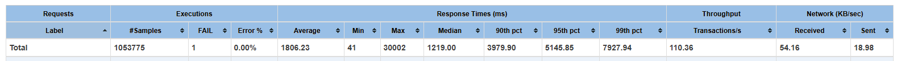
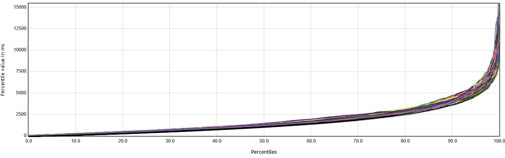
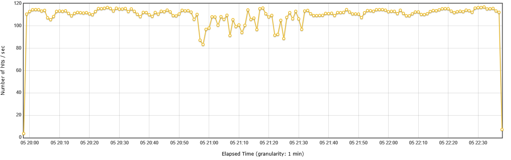
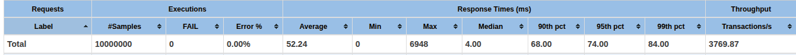
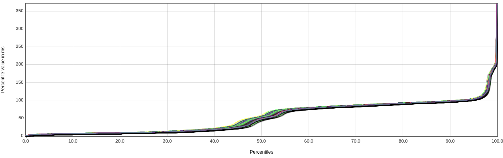
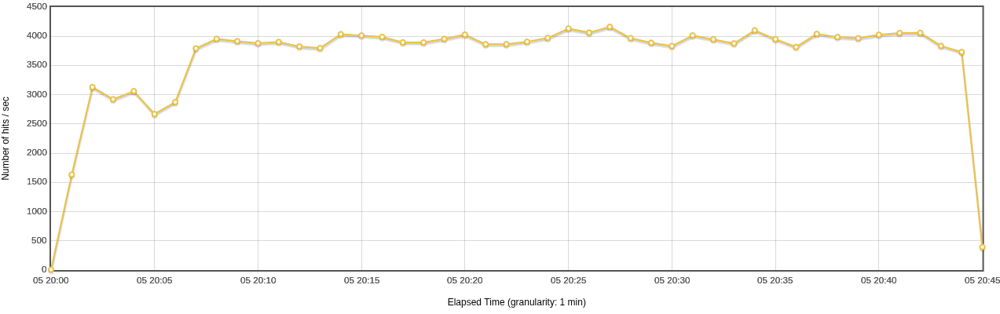

# Report – Microservices & Performance Testing Lab

## Part A – Ratings Service Storage Model (MySQL)

### Design Choice

The Ratings Service was redesigned to use a relational database instead of the default in-memory storage.
The service stores only the minimal data required for its functionality, which includes:

* User ID
* Movie ID
* Rating

This follows the **microservices architecture principle** where each service:

* Owns its own database
* Stores only data related to its domain
* Requests additional data from other services when needed

This design improves:

* Service independence
* Scalability
* Maintainability
* Independent deployment and scaling

Instead of storing movie names or additional movie data in the Ratings Service, the service only stores movie IDs and communicates with the Movie Info service when more data is required.

This approach avoids **data duplication** and keeps the service focused on its domain.

---

### RDBMS vs NoSQL Decision

A relational database (MySQL) was chosen for the Ratings Service because:

**Reasons MySQL is suitable:**

* Data is structured and relational (user → movie → rating)
* Each user rates a movie once
* Transactions may be important (prevent duplicate ratings)
* Data consistency is important
* Query patterns are simple (get ratings for user, movie, etc.)
* Write load is moderate (users do not rate movies frequently)

Therefore, MySQL provides:

* Strong consistency
* ACID transactions
* Simple relational queries
* Low latency for structured queries

**When this choice might become inadequate:**
If the system scales to millions of users and very high read/write throughput, a NoSQL database such as MongoDB or Cassandra could be used because:

* Horizontal sharding is easier
* Higher write throughput
* Better availability
* Eventual consistency may be acceptable

So:

* **Current system → MySQL**
* **Very large scale → NoSQL distributed database**

---

### MySQL Schema (Ratings Service)

You should include something like this in your report:

```sql
CREATE TABLE ratings (
    id INT AUTO_INCREMENT PRIMARY KEY,
    user_id INT NOT NULL,
    movie_id INT NOT NULL,
    rating DOUBLE NOT NULL,
    created_at TIMESTAMP DEFAULT CURRENT_TIMESTAMP,
    UNIQUE (user_id, movie_id)
);
```

**Schema Design Explanation:**

* `user_id + movie_id` unique → user can rate movie only once
* `rating` stored as double
* `created_at` for future analytics
* Minimal schema → only necessary data stored

---

# Part B – Caching MovieDB Results in MongoDB

### Why Caching Was Used

Caching was implemented in the Movie Info Service because this service depends on an **external API** (MovieDB API). External APIs introduce:

* Network latency
* External service delays
* Rate limits or cost per request
* Dependency on third-party availability

Therefore caching improves performance and reliability.

**Benefits of caching:**

* Reduce latency
* Reduce external API calls
* Reduce network bandwidth usage
* Improve throughput
* Improve system reliability
* Avoid API rate limits and cost

---

### Where Caching Matters

Caching is useful when:

* The system is **read-heavy**
* Data does not change frequently
* Operations are expensive
* Many users request the same data

Examples in this system:

* Movie information
* Trending movies
* Popular movies
* Frequently accessed movie details
* Expensive database queries
* External API calls

Caching is **not useful** for:

* Frequently changing data
* Write-heavy workloads
* Data requiring strong consistency

---

### MongoDB Cache Schema

Example MongoDB document:

```json
{
  "movieId": 123,
  "title": "Inception",
  "overview": "A mind-bending thriller",
}
```

**Cache Flow Logic:**

1. Request movie info
2. Check MongoDB cache
3. If found → return cached result
4. If not found → call MovieDB API
5. Save result in MongoDB
6. Return result

---

### Performance Comparison: With and Without Caching

Below are the JMeter performance test results for the Movie Info Service endpoint `/movies/{movieId}`:

#### Without Cache

- **Summary:**  
  
- **Latency Percentiles:**  
  
- **Throughput:**  
  

#### With MongoDB Cache

- **Summary:**  
  
- **Latency Percentiles:**  
  
- **Throughput:**  
  

**Comparison:**

- **Average Latency:** Significantly reduced after enabling cache.
- **P90 Latency:** Lower with cache, indicating more consistent response times.
- **Throughput:** Higher with cache, as the service can handle more requests per second.
- **External API Calls:** Reduced drastically with cache enabled, lowering dependency on the MovieDB API.

---

# Part C – Trending Movies Service (gRPC)

### Service Purpose

The Trending Movies Service was created to determine the **Top 10 Movies based on ratings**.

This service:

* Receives request from Catalog Service via gRPC
* Calls Ratings Service via gRPC
* Calculates Top 10 movies
* Returns results via gRPC to Catalog Service
* Catalog Service exposes REST endpoint to users

Architecture flow:

```
Client → Catalog Service (REST)
          ↓ gRPC
      Trending Service
          ↓ gRPC
      Ratings Service
          ↓
        MySQL
```

---

### Data Source

**From which data source does this service fetch its data?**

The Trending Movies Service fetches its data from the **Ratings Service database (MySQL)** via gRPC.

**Is this adequate?**
Yes for small scale, but not optimal for large scale because:

* Calculating Top 10 requires scanning many ratings
* Repeated queries may be expensive
* Ratings database is OLTP, not analytics optimized

**How to improve performance?**
Better approaches:

1. Maintain a **precomputed Top Movies table**
2. Use **Caching**
3. Use **analytics database**
4. Update Top 10 periodically instead of computing every request

Best real-world solution:

* Background job calculates Top Movies every few minutes
* Store results in Redis
* Trending service reads from Redis (very fast)

---

# Part D


* Latency distribution
* Throughput
* Max requests before failure
* Comparison before/after caching

---